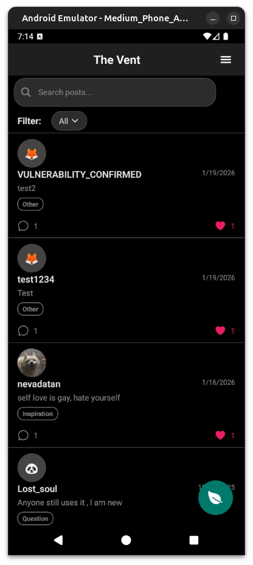
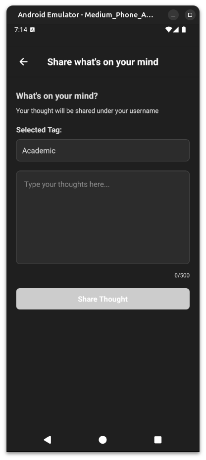
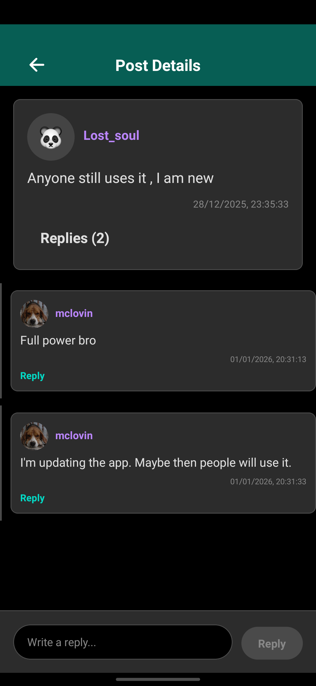

# The Vent

This is a simple, anonymous thought-sharing app built for a small community.

## 🎉 MAJOR UPDATE - Now Fully Open Source!

**Version 2.0** represents a complete migration to a fully open-source stack:

- ✅ **No more Firebase** → Migrated to **Supabase** (PostgreSQL)
- ✅ **No more Cloudinary** → Using **Supabase Storage**
- ✅ **No credit card required** for development
- ✅ **Can be self-hosted** completely for free
- ✅ **No vendor lock-in** - all tools are open source

### What Changed?

| Before (v1.x) | After (v2.0) |
|---------------|--------------|
| Firebase Firestore | Supabase PostgreSQL |
| Firebase Auth | Supabase Auth |
| Firebase Cloud Functions | PostgreSQL Triggers |
| Cloudinary (image hosting) | Supabase Storage |
| **Requires paid plans** | **100% Free tier** |

> **⚠️ Important Notice**
> 
> This app now uses **Supabase** (fully open source!) for everything. If you want to build and run this app yourself, you **must**:
> 
> ### Supabase Setup:
> 1. Create your own Supabase project at [Supabase Dashboard](https://supabase.com/dashboard)
> 2. Follow the complete setup guide in `SUPABASE_SETUP.md`
> 3. Copy `supabaseConfig.example.js` to `supabaseConfig.js` and add your credentials
> 4. Set up the database schema (tables, RLS policies, triggers)
> 5. Create a Storage bucket named `profile-picture` for profile pictures
> 6. Enable Email authentication
> 
> **Why Supabase?**
> - ✅ Fully open source (can self-host)
> - ✅ No credit card required for free tier
> - ✅ PostgreSQL database (more powerful than Firestore)
> - ✅ Built-in Storage (no need for Cloudinary)
> - ✅ Real-time subscriptions
> - ✅ Row Level Security (RLS)
> 
> **The current Supabase configuration in this repository is for the production app and should NOT be used for your own deployments.**

## � Screenshots

<div align="center">
  
  
  
</div>

**Key Features Shown:**
- **Anonymous Feed**: Browse thoughts shared by the community with WhatsApp-style interface
- **Easy Posting**: Share your thoughts with category tags
- **Engage & Reply**: Like and comment on posts anonymously

---

## �📱 Download & Install

### For Android Users:
1. **Download the APK**: Go to the [Releases](https://github.com/yourusername/theventapp/releases) page
2. **Find the latest release** and download the `.apk` file
3. **Install the APK**:
   - Open the downloaded APK file on your Android device
   - If prompted, enable "Install from Unknown Sources" in your device settings
   - Follow the on-screen instructions to complete the installation
   
> **Note**: You may need to allow installation from unknown sources in your device settings. This is safe as the APK is built directly from this project.

### System Requirements:
- Android 5.0 (Lollipop) or higher
- Internet connection for authentication and posting

---

## -- Our Mission --
The Vent provides a space for users to share their thoughts, feelings, and opinions openly and honestly, without the pressure of a public identity. Our goal is to foster a supportive environment where authenticity is encouraged.

## -- Key Features --
- **Pseudo-Anonymous Posting**: Share your thoughts using a custom username (don't include your real name) and an emoji. Other users cannot see your real information.
- **Profile Pictures**: Upload custom profile pictures stored securely in Supabase Storage
- **Simple & Secure**: A straightforward interface for posting and replying to thoughts
- **Like & Reply**: Engage with posts by liking them or adding your own anonymous replies
- **Real-time Updates**: See new posts and replies instantly with Supabase real-time subscriptions
- **Fully Open Source**: Built with open-source technologies - Supabase (PostgreSQL), React Native, Expo

## -- Technical Details & Anonymity --
- **User Authentication**: Email-based authentication via Supabase Auth
- **Data Storage**: All data stored in PostgreSQL database with Row Level Security (RLS)
- **Privacy**: Posts are linked to User IDs but usernames remain pseudonymous
- **Transparency**: While your identity is kept private from other users, administrators can view backend data

## -- Tech Stack --
- **Frontend**: React Native + Expo
- **Backend**: Supabase (PostgreSQL)
- **Authentication**: Supabase Auth
- **Storage**: Supabase Storage (for profile pictures)
- **Real-time**: Supabase real-time subscriptions
- **Database**: PostgreSQL with Row Level Security

---

## 🔧 How to Contribute
If you're interested in contributing to the project, feel free to give your feedback and suggestions.

## 📦 Building from Source
If you'd like to build the app yourself:

1. **Clone the repository**:
   ```bash
   git clone https://github.com/yourusername/theventapp.git
   cd theventapp
   ```

2. **Set up Supabase** (See `SUPABASE_SETUP.md` for detailed instructions):
   - Create a Supabase project
   - Copy `supabaseConfig.example.js` to `supabaseConfig.js`
   - Add your Supabase credentials
   - Run the SQL setup scripts

3. **Install dependencies**:
   ```bash
   npm install
   ```

4. **Build for Android**:
   ```bash
   npm run android:build
   # or
   eas build --platform android
   ```

4. **Run in development**:
   ```bash
   npx expo start
   ```